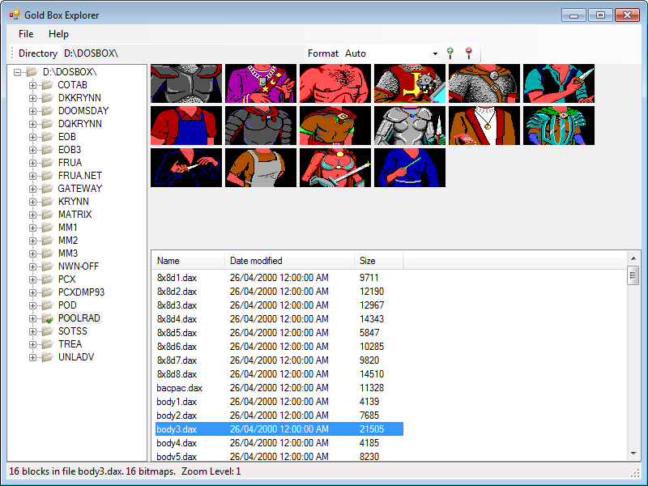
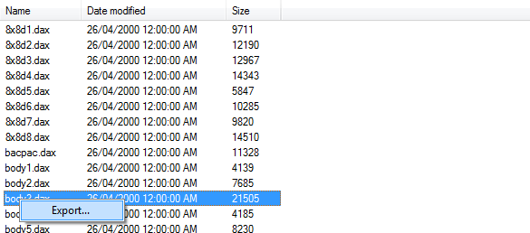
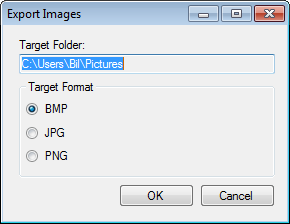
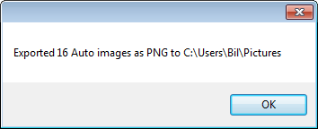
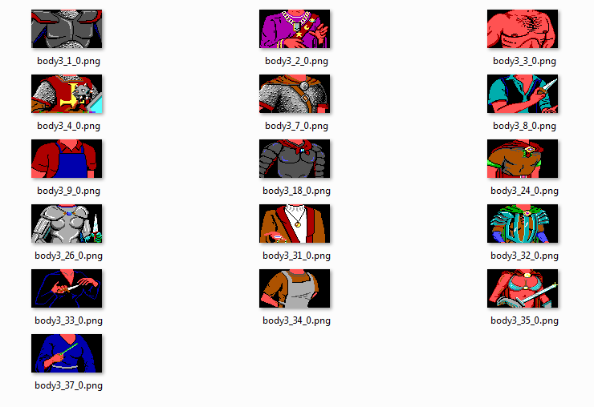

# Exporting

Gold Box Explorer lets you export all images from a DAX file in several forms. In this example, we'll export the contents of a file from Pool of Radiance.

In the file list, select the file you want to export images from and right click to bring up the **Export** menu.

Click on **Export** and this will launch the **Export Images** dialog.

From here you can select the folder where to export images to (defaults to the users My Pictures directory) and setting the output format (Windows Bitmap, JPEG, or PNG). Click **OK** to export the images to the target directory. A dialog box will pop up after the export is done to indicate the number of images saved and in what format.

Once exported you can view the images in Windows Explorer and use them in other programs.

The files are saved using this naming convention:

{"[DAX File Name](DAX-File-Name)_[Block Id](Block-Id)_[Bitmap Number](Bitmap-Number).[File Format](File-Format)"}

Where:
* **DAX File Name** is the original filename where the image was exported from (without the .DAX extension)
* **Block Id** is a saved id number that each block in a DAX file has
* **Bitmap Number** is the sequential number of the bitmap in the block. Some blocks contains more than one bitmap
* **File Format** is the exported format (BMP, JPG, or PNG)

_Note: Exported images overwrite any other files with the same name without prompting_