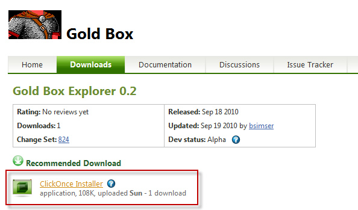
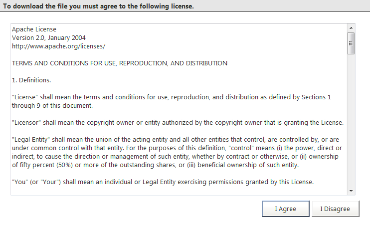
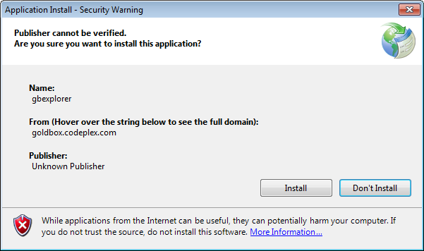
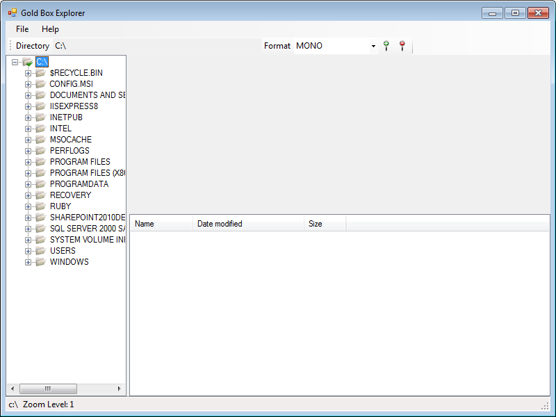

# Installing

Gold Box Explorer comes as a ClickOnce application. ClickOnce is a Microsoft technology that enables the user to install and run a Windows application by clicking a link in a web page. There is no file to unzip and the installer to run is simple. You can also just download a zip file containing the binary files. Unzip and run gbexplorer.exe and you'll be all set.

## To install Gold Box Explorer using ClickOnce

**Firefox Users**
ClickOnce installs work fine for Internet Explorer users but if you're using FireFox you'll need to ensure that the **Microsoft .NET Framework Assistant** add-on is installed.

# Inside of Firefox click on **Tools** then **Add-ons**
# In the search box type **ClickOnce** and press **Enter** (you should see the **Microsoft .NET Framework Assistant**)
# Click **Add to Firefox**
# The **Microsoft Public License (Ms-PL)** is displayed
# Click on **Accept and Install...** to continue the installation
# A final confirmation will ask you to continue. Click **Install Now**
# You'll need to restart Firefox to complete the changes. Click **Restart Firefox**
# Firefox is now ready to use ClickOnce

Navigate to the releases page and downloaded the latest release [release:52560](release_52560)

Click on the **ClickOnce Installer** link under the Recommended Download

The Apache 2.0 license will be shown. You must click **I Agree** to continue installing the program.

A dialog will come up about the publisher. The project is unsigned and will warn you that the publisher cannot be verified. Click **Install** to continue installing the program.

The program will download the install the application. Once this is done the application will launch in its default state.

You're now ready to start exploring!