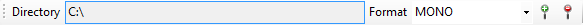
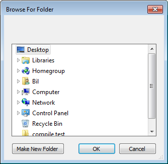
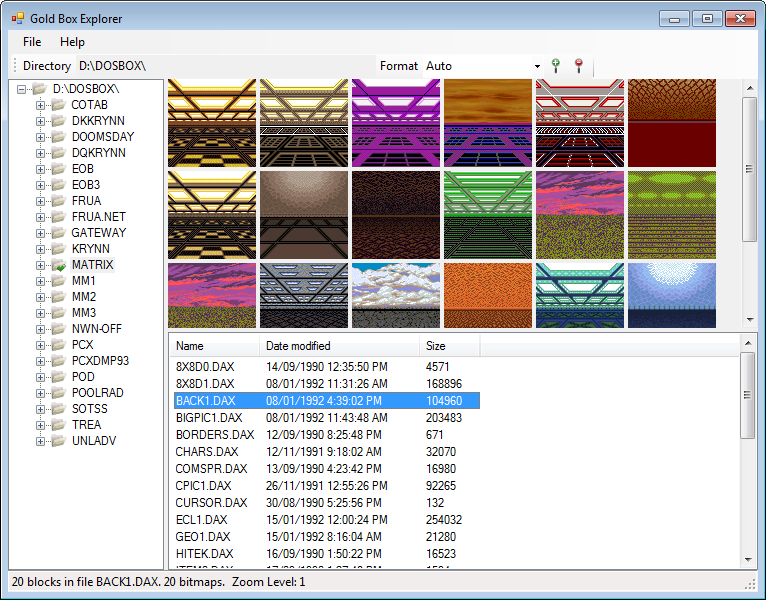
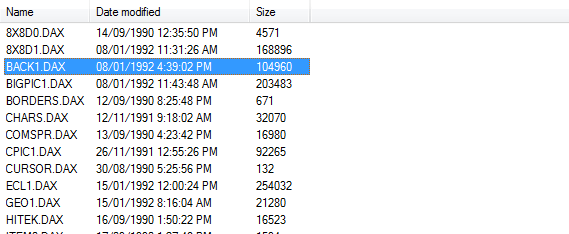
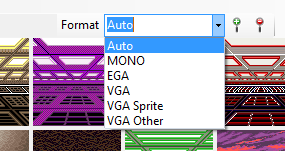
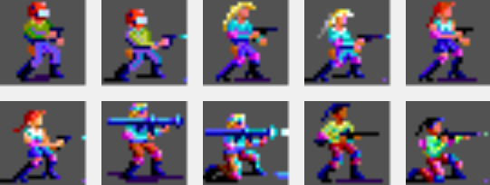
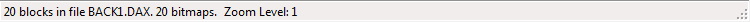

# Using the Program

**Initial Launch**

When you launch Gold Box Explorer for the first time the default folder is C:\

People generally don't have their Gold Box games in the root of C: these days so let's change that.

**Changing Directories**

Click on the text box next to **Directory** in the toolbar. This text box contains the current directory the program is using for browsing content.

This will bring up the **Browse for Folder** dialog.

Navigate to where your Gold Box games are and click **OK**. The dialog will close and the treeview will be updated with the folder you selected. You can change this value at any time. It's saved when you exit the program so the next time you launch it, it will remember where your Gold Box games are.

**Viewing Files**

To view files, select a folder from the treeview on the left hand side. Once you select a folder, a series of files will be populated in the file list. Select one of those files to view the contents of that file. For example, here are the images from the BACK1.DAX file displayed from the Buck Rogers game, Matrix Cubed.

**Selecting Files**

When you select a file in the list, the contents are read in and displayed in the main viewing area of the program. Additional information about the file is displayed in the list including the date the file was last modified and the size in bytes. 

**Changing Formats**

Different images in Gold Box files use different encoding schemes. The program tries to automatically determine the format and display it appropriatley but sometimes it just doesn't know. You can change the format used for reading the files by selecting it in the Format drop down.

* **Auto** - Tries to automatically determine the rendering method and goes through several passes trying the various decoders to find the right one. It's not perfect but it does its best. You should be able to use this setting for most files.
* **Mono** - Mono images, usually ones named starting with "8x8"
* **EGA** - The most common format for most of the early games (Pool of Radiance, etc.)
* **VGA** - Later games used this format including the Buck Rogers games, Matrix Cubed
* **VGA Sprite** - A variation of the VGA decoder where multiple frames are used. You'll find these in Pool of Darkness files
* **VGA Other** - Experimental right now but successfully decodes some Treasures of the Savage Frontier files

For a full list of what setting to use for what file, please see the [Status Report](Status-Report) pages which lists all games and what to use.

**Zooming**

The program allows you to zoom in and out while viewing the images in a file. The Zoom buttons can be found on the toolbar. Click on the first button (the magnifying glass with a + symbol) to zoom in, which doubles the size of any images. Click on the second button to zoom out, which halves the size of the image. 

Zooming is useful to see some of the smaller (16x16) images. Zooming images will create a "blurry" looking image but it might help you see it better. Here's some characters zoomed four times.

You cannot zoom out further than the original size of the image. When you select a different file, the zoom is reset. You can see the current zoom level displayed in the status bar.

